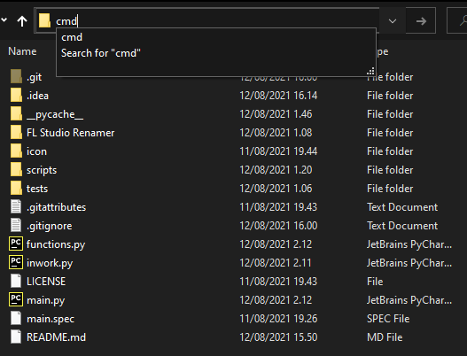

### Rename FL Studio audio files made in
1. Mixer >
2. Disk Recording >
3. Render to wave files
* [Video coming soon...]()

### What this script does?  
###### We give project name and the script is:
* Making new folder with given name
* Moving the files to new folder which matches with the given name
* Renaming the files 
```
  # The file after it's rendered : 
    Python test_2021-08-09 20-46-37_3 - Bass
  
  # After script is executed :
    Python test_2021-08-09 20-46-37_  is removed
    and the new name of the file is: 
    3 - Bass 

```
## Getting Started

### Dependencies

* [Install pyinstaller](https://pyinstaller.readthedocs.io/en/stable/installation.html)
* Windows 10
* FL Studio 20.8+ ```(Older versions might work aswell)```


### Installing

1. Clone repo or Download Zip / Unzip file
2. Move the folder and file content to **YOUR_LOCATION**
3. run cmd
4. cd **TO YOUR_LOCATION**

##### OR
1. Locate the folder
2. Type cmd on address bar


```
pyinstaller --noconfirm --onefile --console --icon=./icon/favicon.ico ./main.py
```
3. locate folder ./dist
4. move main.exe to ./application
5. Right click main.exe file -> Send to -> Desktop

### Executing program in terminal

1. run cmd
2. ex. ```cd %userprofile%/Downloads/fl_studio_stem_renamer && python main.py```

## Authors

Contact info
[@Juhamikaell](https://instagram.com/juhamikaell)

## Version History

* Version 0.1
  * Initial Release
* Version 0.2
  * Fixed Bugs:
    * Type project name with spaces 
    * lower case folder name

  
 ### More info and videos coming soon!

