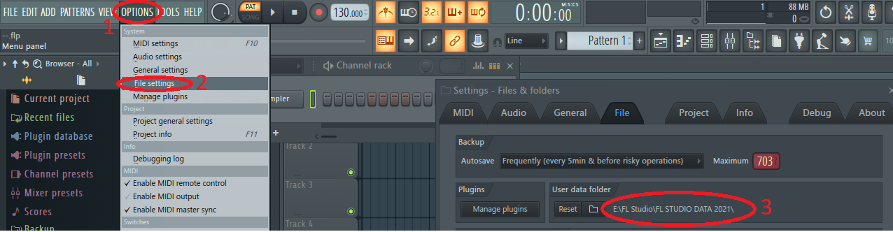

## FL STUDIO STEM RENAMER
### # This script edit FLStudio audio files made in FL Studio 
```
1. Mixer 
    2. Disk Recording 
        3. Render to wave files
```
* [Video & Picture coming soon...]()

### # What this script does?  
###### # We just give project name and the script is:
* Making new folder with given name
* Moving the files to new folder which matches with the given name
* Renaming the files 
```
  # The file after it's rendered : 
    Testing_2021-08-09 20-46-37_1 - Bass
  
  # After script is executed :
    Python test_2021-08-09 20-46-37_  is removed
    and the new name of the file is: 
    1 - Bass 

```
## # Getting Started


### Dependencies
* Windows 10
* FL Studio 20.8+ ```(Older versions might work aswell)```


### Installing

1. Clone repo or Download Zip / Unzip file
2. Move the folder and file content to **YOUR_LOCATION -  *ex.Desktop***
3. Locate the folder
4. Type cmd on address bar


IMAGE 1

```
            !! IMPORTANT - YOU NEED TO EDIT CONFIG FILE !!
```
  IN FL STUDIO, GO TO:
  1. OPTIONS
  2. FILE SETTINGS
  3. LOCATE USER DATA FOLDER PATH




1. Locate Folder
2. Open config.ini with any text editor
3. EDIT LINE 15 ```custom_path = <!YOUR USER DATA FOLDER!>```
4. REPLACE ->```<!YOUR USER DATA FOLDER!>```<- with ```THE PATH YOU HAVE IN USER DATA FOLDER```

### Executing program in terminal
1. run cmd (See IMAGE 1)
2. `python main.py`

## # Authors

Contact info
[@Juhamikaell](https://instagram.com/juhamikaell)

## # Version History

* Version 0.1
  * Initial Release
* Version 0.2
  * Fixed Bugs:
    * Type project name with spaces 
    * lower case folder name
* Version 0.3
  * Can be ran only from CMD

 ### More info and videos coming soon!